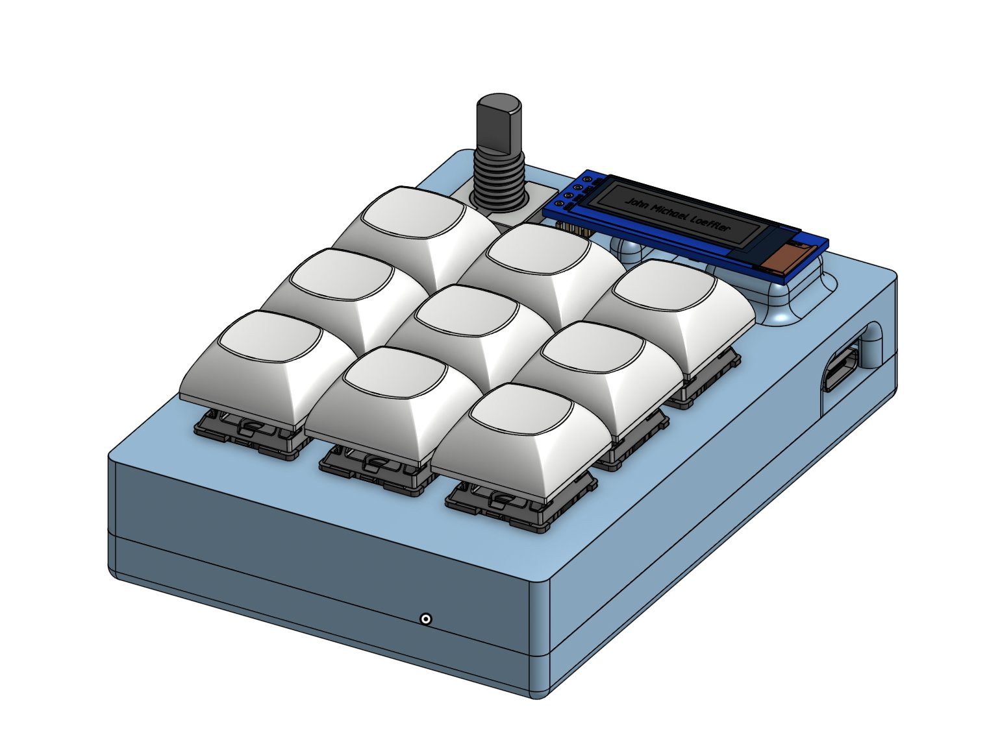
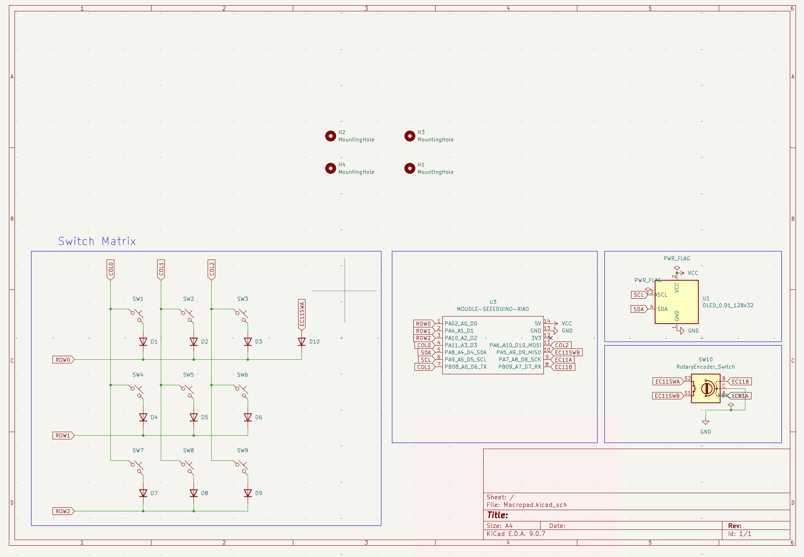
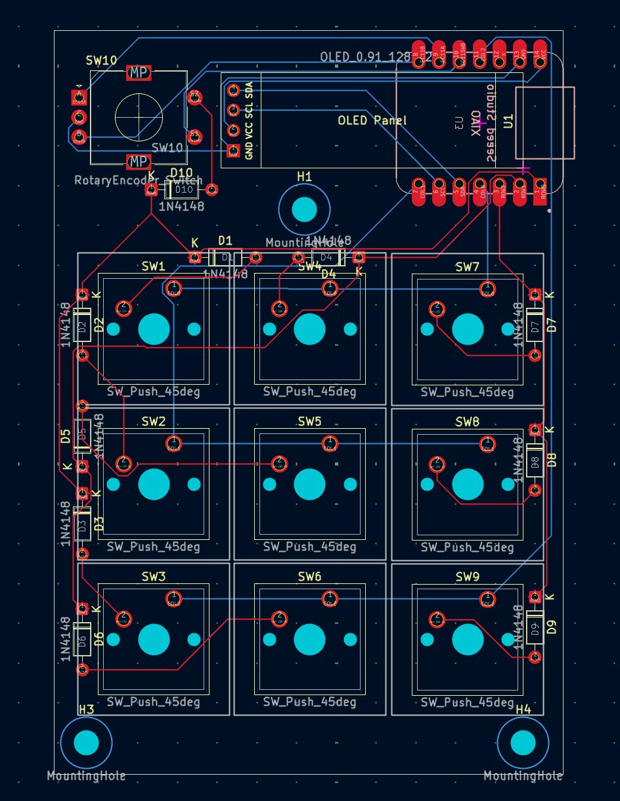
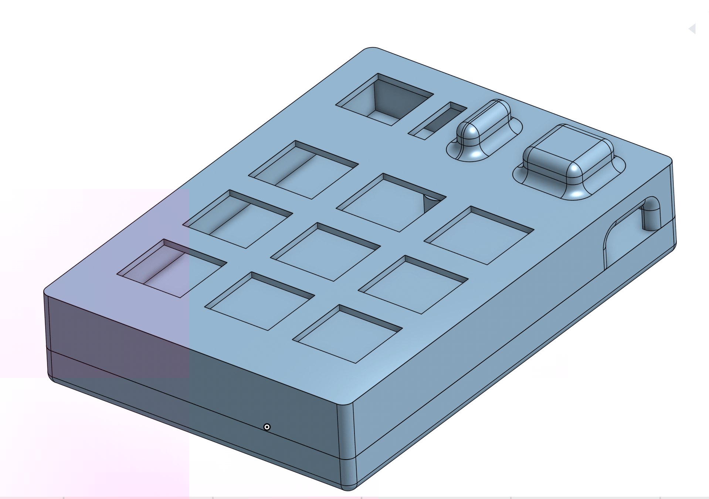

# Command Node

A fully custom 3D printed macropad built from scratch with a 3×3 key grid, rotary encoder, and OLED display.

## Features

- 9x Cherry MX switches in a 3×3 layout
- EC11 rotary encoder (volume control + OS toggle click)
- 0.91" 128×32 SSD1306 OLED display showing name and current OS layer
- Dual OS support — toggle between Windows and Mac layouts instantly
- KMK firmware written in CircuitPython (no compiling needed!)
- 3D printed case with heat-set inserts
- Seeed XIAO RP2040 microcontroller

## Overall Design



The macropad features a compact 3×3 key layout with the rotary encoder and OLED display across the top. The USB-C port is accessible from the right side. The two-part 3D printed case is held together with M3 screws and heat-set inserts.

## PCB

| **Schematic**                      | **PCB Layout**         |
| ---------------------------------- | ---------------------- |
|  |  |

The PCB was designed in KiCad. The switch matrix uses COL2ROW diode direction with 1N4148 diodes. The OLED connects via I2C on SDA/SCL pins, and the EC11 encoder click is wired as a direct pin (no diode needed).

- [x] I ran DRC and there are 0 errors

## CAD



The case is two-part and 3D printed. The top shell holds the switches, encoder, and OLED in place, while the bottom shell houses the PCB. Everything is secured with 4x M3x16mm screws threading into M3x5x4mm heat-set inserts pressed into the bottom shell.

[OnShape Link](https://cad.onshape.com/documents/35dce9458257a454ca9a87ec/w/10d574b05dc610b688c542cb/e/be3f2022d5b231c4560e80a7)

## Firmware

Written using **KMK** (CircuitPython) — no compiling or flashing needed after the initial CircuitPython setup. Just edit `code.py` on the `CIRCUITPY` drive and it reloads automatically.

**Key layout:**

```
[ Prev  ] [ Play  ] [ Next  ]
[ Ctrl+Z] [ Ctrl+C] [ Ctrl+V]
[ Scrnsh] [ Sleep ] [ Scrnsvr]
         [Enc Click = OS Toggle]
```

**Encoder rotation:** Volume down / Volume up

**OS Toggle:** Pressing the encoder switches between Windows mode (Ctrl shortcuts, Print Screen) and Mac mode (Cmd shortcuts, Cmd+Shift+4 screenshot). The OLED updates to show the current OS.

**OLED display:** Shows name and current active OS layer dynamically.

You can find the full `main.py` in the `firmware/` folder of this repo.

## BOM

| Part                             | Quantity | Notes                                     |
| -------------------------------- | -------- | ----------------------------------------- |
| Seeed XIAO RP2040                | 1        | Microcontroller                           |
| Cherry MX Switches               | 9        | Any MX-compatible switch                  |
| 1N4148 Diodes (through-hole)     | 10       | 9 for switch matrix + 1 for encoder click |
| EC11 Rotary Encoder              | 1        | With push-click                           |
| 0.91" SSD1306 OLED (128×32, I2C) | 1        | Pin order: GND-VCC-SCL-SDA                |
| DSA Keycaps                      | 9        | White blank                               |
| M3x16mm Screws                   | 4        | For case assembly                         |
| M3x5x4mm Heat-set Inserts        | 4        | Press into bottom shell                   |
| PCB                              | 1        | Custom KiCad design                       |
| 3D Printed Case (top + bottom)   | 1 set    | PLA or PETG                               |
